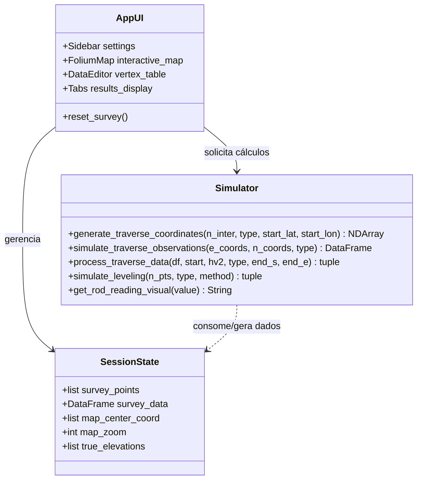
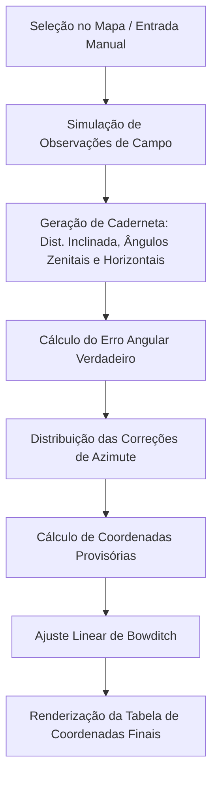
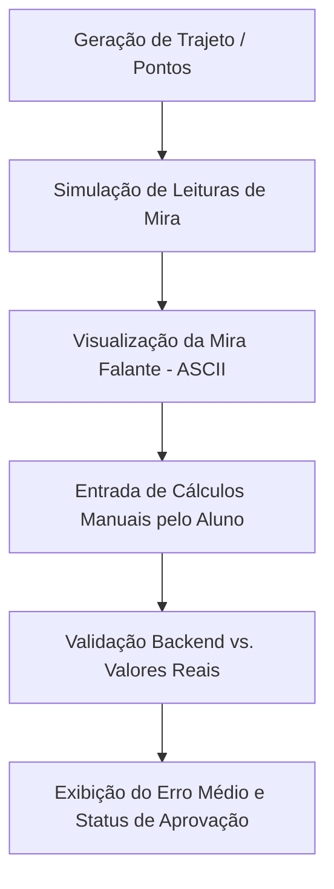

# Simulador de Levantamentos Topográficos

Simulador interativo para o aprendizado prático de poligonação (traverses) e nivelamento (leveling). O sistema permite a simulação de dados de campo, processamento de cálculos topográficos e validação pedagógica através do "Modo Desafio".

## Arquitetura do Sistema

Abaixo está representada a organização das classes de estado e os módulos funcionais do simulador.



## Fluxo de Execução Funcional

O diagrama a seguir detalha a cadeia de processamento para os modos de Poligonação e Nivelamento.

### 1. Fluxo de Poligonação (Traverse)


### 2. Fluxo de Nivelamento (Leveling)


## Tecnologias Utilizadas

- **Frontend:** Streamlit, Folium, streamlit-folium.
- **Cálculos:** NumPy, Pandas, UTM.
- **Distribuição:** Stlite (WebAssembly para execução no navegador).

## Como Executar

Para rodar localmente:
```bash
pip install streamlit folium streamlit-folium numpy pandas utm
streamlit run app.py
```
