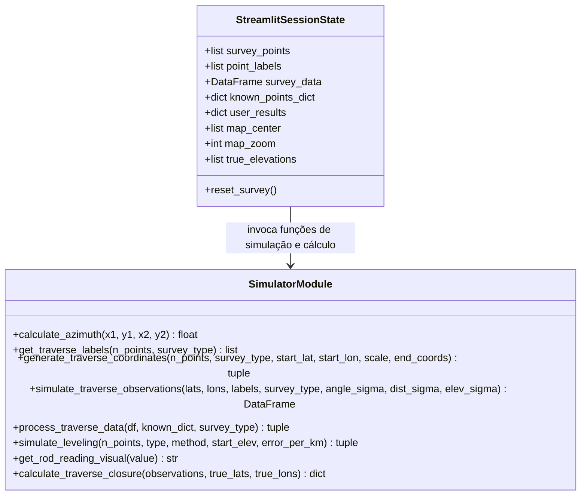
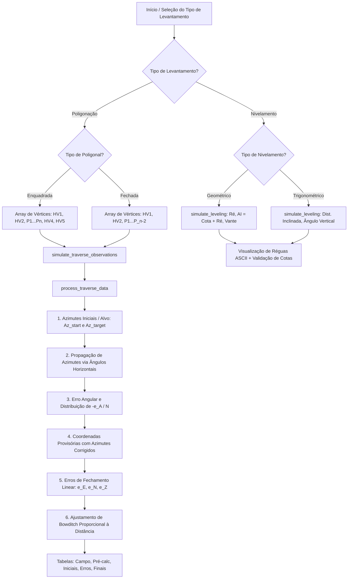

# Simulador Interativo de Levantamentos Topográficos e Geodésicos

Simulador de Levantamentos Topográficos e Geodésicos desenvolvido em Python e Streamlit para o apoio ao ensino de Poligonação (Fechada e Enquadrada) e Nivelamento (Geométrico e Trigonométrico).

## Configurações Padrão
* **Sistema de Referência (CRS):** UTM ZONA 22S, Meridiano Central 51°W.
* **Centro Padrão do Mapa:** Campus Politécnico da UFPR (Easte: 677.878,516 m; Norte: 7.184.223,309 m; Lat: -25.448369°, Lon: -49.230955°).

---

## Arquitetura e Estrutura do Sistema

### 1. Diagrama de Classes e Estrutura de Estado


```mermaid
classDiagram
    class StreamlitSessionState {
        +list survey_points
        +list point_labels
        +DataFrame survey_data
        +dict known_points_dict
        +dict user_results
        +list map_center
        +int map_zoom
        +list true_elevations
        +reset_survey()
    }

    class SimulatorModule {
        +calculate_azimuth(x1, y1, x2, y2) float
        +get_traverse_labels(n_points, survey_type) list
        +generate_traverse_coordinates(n_points, survey_type, start_lat, start_lon, scale, end_coords) tuple
        +simulate_traverse_observations(lats, lons, labels, survey_type, angle_sigma, dist_sigma, elev_sigma) DataFrame
        +process_traverse_data(df, known_dict, survey_type) tuple
        +simulate_leveling(n_points, type, method, start_elev, error_per_km) tuple
        +get_rod_reading_visual(value) str
        +calculate_traverse_closure(observations, true_lats, true_lons) dict
    }

    StreamlitSessionState --> SimulatorModule : invoca funções de simulação e cálculo
```

---

### 2. Diagrama do Fluxo de Execução Funcional


```mermaid
flowchart TD
    A[Início / Seleção do Tipo de Levantamento] --> B{Tipo de Levantamento?}

    %% Poligonação
    B -->|Poligonação| C{Tipo de Poligonal?}
    C -->|Enquadrada| D[Array de Vértices: HV1, HV2, P1...Pn, HV4, HV5]
    C -->|Fechada| E[Array de Vértices: HV1, HV2, P1...P_n-2]

    D --> F[simulate_traverse_observations]
    E --> F

    F --> G[process_traverse_data]
    G --> H1[1. Azimutes Iniciais / Alvo: Az_start e Az_target]
    H1 --> H2[2. Propagação de Azimutes via Ângulos Horizontais]
    H2 --> H3[3. Erro Angular e Distribuição de -e_A / N]
    H3 --> H4[4. Coordenadas Provisórias com Azimutes Corrigidos]
    H4 --> H5[5. Erros de Fechamento Linear: e_E, e_N, e_Z]
    H5 --> H6[6. Ajustamento de Bowditch Proporcional à Distância]
    H6 --> I[Tabelas: Campo, Pré-calc, Iniciais, Erros, Finais]

    %% Nivelamento
    B -->|Nivelamento| J{Tipo de Nivelamento?}
    J -->|Geométrico| K[simulate_leveling: Ré, AI = Cota + Ré, Vante]
    J -->|Trigonométrico| L[simulate_leveling: Dist. Inclinada, Ângulo Vertical]

    K --> M[Visualização de Réguas ASCII + Validação de Cotas]
    L --> M
```

---

## Como Executar
1. Instale as dependências:
   ```bash
   pip install -r requirements.txt
   ```
2. Execute o aplicativo:
   ```bash
   streamlit run app.py
   ```
3. Execute os testes unitários:
   ```bash
   export PYTHONPATH=$PYTHONPATH:.
   python3 -m unittest discover -s tests
   ```
